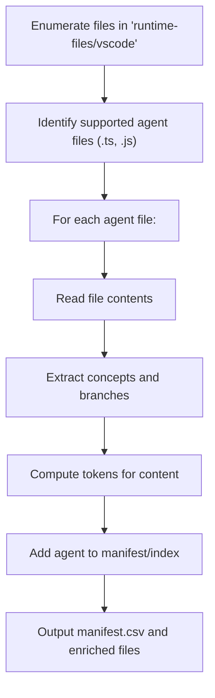

```mermaid
flowchart TD
    A["Enumerate files in 'runtime-files/vscode'"]
    B["Identify supported agent files (.ts, .js)"]
    C["For each agent file:"]
    D["Read file contents"]
    E["Extract concepts and branches"]
    F["Compute tokens for content"]
    G["Add agent to manifest/index"]
    H["Output manifest.csv and enriched files"]

    A --> B
    B --> C
    C --> D
    D --> E
    E --> F
    F --> G
    G --> H
```

[//]: # (This content was generated by AppMap Navie.)
[//]: # (messageId: 77f1332d-9288-4e2e-a5e0-8cb42aada164)
[//]: # (threadId: 3058a71e-f2a0-4938-b483-08a519a893e5)
